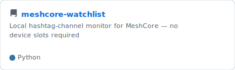
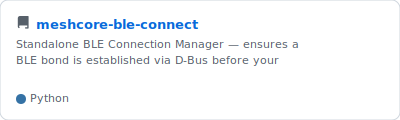
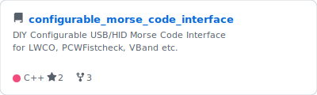
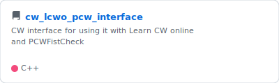
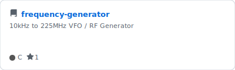

# PE1HVH 

Amateur radio operator · Open-source developer 

---

## About me
Focused on open-source tooling for the amateur radio community — from LoRa/MeshCore mesh networks to HF monitoring and CW interfaces.

Active in **NoodNet Zwolle** (emergency communications) and **DOMCA** (Dutch Open MeshCore Activity).

---

## Public repositories

<!-- REPOS_START -->
<!-- 15 repos — auto-updated by GitHub Actions -->

<!-- REPOS_END -->

---

## Interests

`MeshCore / LoRa` &nbsp;·&nbsp; `BLE / BlueZ` &nbsp;·&nbsp; `HF amateur radio` &nbsp;·&nbsp; `CW / Morse` &nbsp;·&nbsp; `ESP32 / Arduino` &nbsp;·&nbsp; `Python` &nbsp;·&nbsp; `PHP` &nbsp;·&nbsp; `NoodNet`
