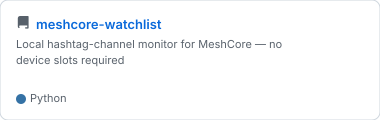
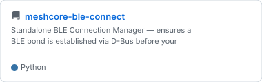
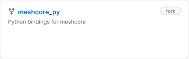
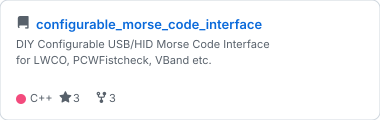
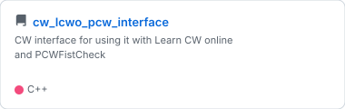
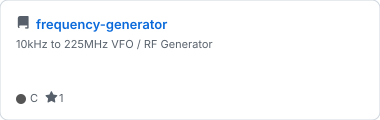
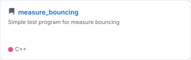
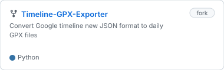

# PE1HVH 

Amateur radio operator · Open-source developer 

---

## About me
Focused on open-source tooling for the amateur radio community — from LoRa/MeshCore mesh networks to HF monitoring and CW interfaces.

Active in **NoodNet Zwolle** (emergency communications) and **DOMCA** (Dutch Open MeshCore Activity).

---

## Public repositories

<!-- REPOS_START -->
<!-- 16 repos — auto-updated by GitHub Actions -->

<a href="https://github.com/pe1hvh/meshcore-docs"><picture><source media="(max-width: 1199px)" srcset="cards/meshcore-docs-wide.svg"></picture></a><a href="https://github.com/pe1hvh/meshcore-gui"><picture><source media="(max-width: 1199px)" srcset="cards/meshcore-gui-wide.svg"></picture></a>
<a href="https://github.com/pe1hvh/meshcore-bridge"><picture><source media="(max-width: 1199px)" srcset="cards/meshcore-bridge-wide.svg"></picture></a><a href="https://github.com/pe1hvh/meshcore-watchlist"><picture><source media="(max-width: 1199px)" srcset="cards/meshcore-watchlist-wide.svg"></picture></a>
<a href="https://github.com/pe1hvh/meshcore-observer"><picture><source media="(max-width: 1199px)" srcset="cards/meshcore-observer-wide.svg"></picture></a><a href="https://github.com/pe1hvh/meshcore-ble-connect"><picture><source media="(max-width: 1199px)" srcset="cards/meshcore-ble-connect-wide.svg"></picture></a>
<a href="https://github.com/pe1hvh/meshcore_py"><picture><source media="(max-width: 1199px)" srcset="cards/meshcore_py-wide.svg"></picture></a>

<a href="https://github.com/pe1hvh/configurable_morse_code_interface"><picture><source media="(max-width: 1199px)" srcset="cards/configurable_morse_code_interface-wide.svg"></picture></a><a href="https://github.com/pe1hvh/VBand_interface"><picture><source media="(max-width: 1199px)" srcset="cards/VBand_interface-wide.svg"></picture></a>
<a href="https://github.com/pe1hvh/cw_lcwo_pcw_interface"><picture><source media="(max-width: 1199px)" srcset="cards/cw_lcwo_pcw_interface-wide.svg"></picture></a>

<a href="https://github.com/pe1hvh/frequency-generator"><picture><source media="(max-width: 1199px)" srcset="cards/frequency-generator-wide.svg"></picture></a><a href="https://github.com/pe1hvh/platformIO2arduinoIDE"><picture><source media="(max-width: 1199px)" srcset="cards/platformIO2arduinoIDE-wide.svg"></picture></a>
<a href="https://github.com/pe1hvh/measure_bouncing"><picture><source media="(max-width: 1199px)" srcset="cards/measure_bouncing-wide.svg"></picture></a>

<a href="https://github.com/pe1hvh/Timeline-GPX-Exporter"><picture><source media="(max-width: 1199px)" srcset="cards/Timeline-GPX-Exporter-wide.svg"></picture></a><a href="https://github.com/pe1hvh/TimeLine2MariaDB"><picture><source media="(max-width: 1199px)" srcset="cards/TimeLine2MariaDB-wide.svg"></picture></a>

<!-- REPOS_END -->

---

## Interests

`MeshCore / LoRa` &nbsp;·&nbsp; `BLE / BlueZ` &nbsp;·&nbsp; `HF amateur radio` &nbsp;·&nbsp; `CW / Morse` &nbsp;·&nbsp; `ESP32 / Arduino` &nbsp;·&nbsp; `Python` &nbsp;·&nbsp; `PHP` &nbsp;·&nbsp; `NoodNet`
